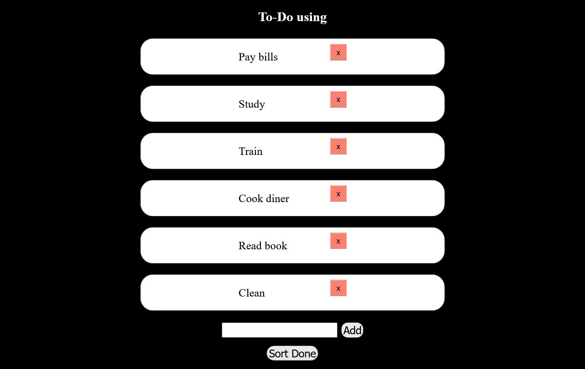

## Table of contents

- [Overview](#overview)
  - [Javascript To Do](#javascript-to-do)
  - [Project setup](#project-setup)
  - [Built with](#built-with)
  - [Screenshot](#screenshot)
  - [Author](#author)

## Overview

### Javascript To Do

Welcome to JavaScript To do list!

This assignment is a To-do list from Medieinstitutet Stockholm Sweden.

This is the first JavaScript project I did. As you can see on github, this was also the first time i tried github branches.

The main branch is called master in this project because it's an old project.

---

THE CODE

1. First i created the class JsList{} with a constructor with two properties: this.item and this.done.

2. Then I created the objects firstObject to sixthObject and merge the objects with objectToArrays=[] an array of objects.

3. The function toLocalStorage() converts objectToArrays to JSON so it can be move to the localStorage.

4. After that the function createHtmlLi() is created. That finds the div for the array in the index.html. And creates html.

5. removeItem() function is created for splicing(removing) the items from the array.

6. check() function looks if the objects boolean is true or false.

7. createSort() and sortDone() sorts the objects in the array.

8. addToDos() adds the new objects to the array.

---

## Project setup

```
npm install
```

### Compiles and hot-reloads for development

```
npm run sass
```

### Built with

- html
- scss/sass
- javascript

### Screenshot



### Author

[Github](https://github.com/Rasweb)
